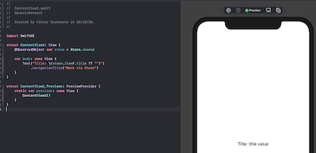

# GenericNetwork

## Code from aticles 
[Creating generic networking APIs in Swift](https://www.swiftbysundell.com/articles/creating-generic-networking-apis-in-swift/) 
[Testing networking logic in Swift](https://www.swiftbysundell.com/articles/testing-networking-logic-in-swift/) 

Implemented mock via View.onAppear for Canvas Preview without running Live mode. 

Implemented mock via Store for Canvas Preview without running Live mode. 

