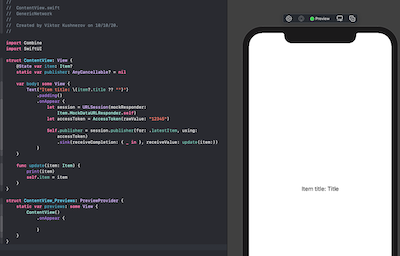

# GenericNetwork

Code from aticles 
[Creating generic networking APIs in Swift](https://www.swiftbysundell.com/articles/creating-generic-networking-apis-in-swift/)
[Testing networking logic in Swift](https://www.swiftbysundell.com/articles/testing-networking-logic-in-swift/)

Implemented mock to support in Canvas Preview.

